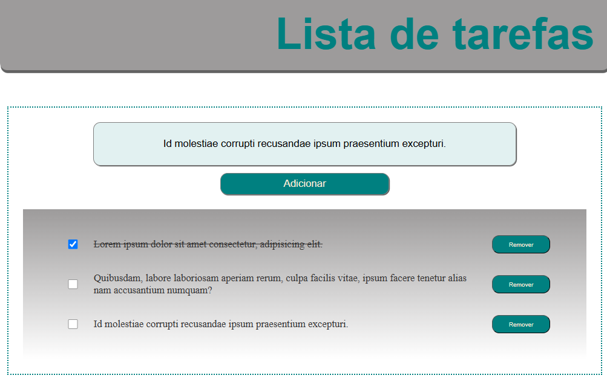

# Projeto JS: lista de Tarefas

A proposta desse projeto foi criar uma aplicação web para organizar uma lista de tarefas salvando-a no local storage.

[Clique aqui para acessar!!👈](https://tiemi9.github.io/Projeto_ListaDeTarefas/)

## 🎮 Tecnologias utilizadas:

  - HTML
  - CSS
  - JavaScript
  - Git e GitHub

### 💌 Agradecimentos

"Gratidão à todos os envolvidos nesse curso, Santander, Ada Tech e Let's Code que dedicaram seu tempo para formação de novos profissionais."
Então... bora codar!! 
